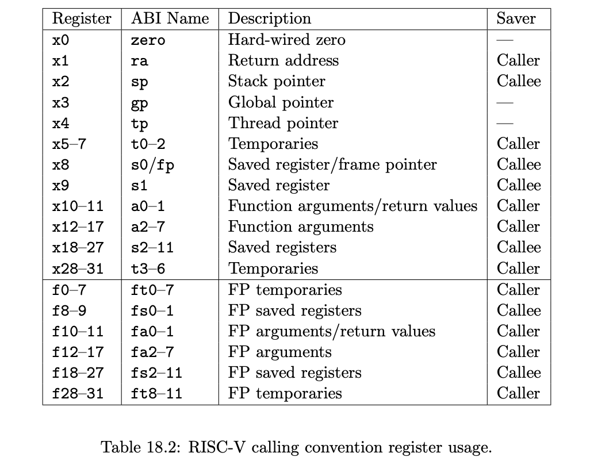
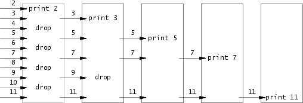
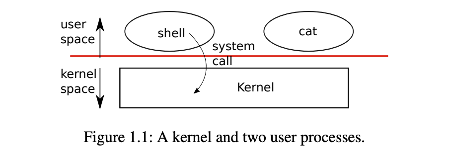

# 一周目
## RISCV
riscv的手册可查看此网址：[http://staff.ustc.edu.cn/~llxx/cod/reference_books/RISC-V-Reader-Chinese-v2p12017.pdf](http://staff.ustc.edu.cn/~llxx/cod/reference_books/RISC-V-Reader-Chinese-v2p12017.pdf)

### RISCV的寄存器




## 简单介绍一下primes的实现原理？
primes的实现原理如下图所示。  

 
首先在main函数中将2-35（因xv6的内存较小，写入数字过多则内存不足）写入管道中，然后fork产生一个子进程，子进程从该管道中读出的第一个数字一定是一个素数，记为n，然后依次读出管道中的数字记为num，将$num \% n!=0$的num写入下一个管道，然后fork产生子进程来处理这个管道，直至管道中无法读出数字，此时处理完毕。  
这个方法会fork大量子进程，因此，其效率并不比单进程计算素数快，但是给我们使用进程提供了一个新的思路。

## 管道相关
### 管道的数据结构定义
```c
#define PIPESIZE 512

struct pipe {
  struct spinlock lock;
  char data[PIPESIZE];
  uint nread;     // number of bytes read
  uint nwrite;    // number of bytes written
  int readopen;   // read fd is still open
  int writeopen;  // write fd is still open
};
```
### 函数定义
有以下相关函数
1. int pipealloc(struct file **f0, struct file **f1)  
  分配一个pipe，返回0表示成功，-1表示失败
2. void pipeclose(struct pipe *pi, int writable)  
  关闭管道。在关闭管道时，如果管道内有数据，则wakeup相关进程然后将数据读取出去，然后关闭管道。如果没有数据，并且读写都已经关闭，则释放该页表，否则不释放页表，仅仅解锁。
3. int pipewrite(struct pipe *pi, uint64 addr, int n) 
  从addr地址处读取n个字节写入管道，返回写入的字节数。在写入管道时，如果管道已满，则睡眠写入进程，然后等到有进程读取数据后，wakeup该进程再继续向管道中写入。写入完毕后，唤醒该管道的读端进程。返回写入的字节数。
4. int piperead(struct pipe *pi, uint64 addr, int n)  
  从管道中读入n个字节写入addr地址处，返回读取的字节数。在读取管道时，如果管道没数据，则阻塞当前进程，等待写端向管道中写入数据，届时会唤醒此进程。在读取数据后会唤醒写端进程。
在读端和写端都会给管道上锁，防止数据冲突。这里是用的是spinlock自旋锁。  
*如果了解go语言的管道channel，可以发现其机制与xv6中的管道相同*

## find相关
### 文件系统初步介绍
```c
// kernel/fs.h
// Disk layout:
// [ boot block | super block | log | inode blocks |
//                                          free bit map | data blocks]
```
xv6使用的文件系统是--早期 Unix 文件系统布局（Early Unix File System Layout）
这段注释显示一个文件系统的基本结构。在这个文件系统中，磁盘被划分为几个逻辑块，每个逻辑块负责存储特定类型的数据。
具体地说，磁盘布局包括以下几个部分：
1. 引导块（boot block）：这是启动磁盘的一小段代码，用于引导计算机系统加载操作系统。
2. 超级块（super block）：超级块存储了关于整个文件系统的元数据信息，如文件系统的大小、块大小、inode（索引节点）的数量等。
3. 日志（log）：日志是一种用于记录文件系统操作的机制，可以用来恢复文件系统的一致性。当发生文件系统修改时，操作会首先被记录在日志中，然后再被应用到实际的文件系统结构中。
4. inode 块（inode blocks）：inode 是文件系统中的一种数据结构，用于存储文件或目录的元数据，如文件大小、权限、所有者等。inode 块存储了多个 inode。
5. 空闲位图（free bit map）：空闲位图用于跟踪磁盘上的空闲块，以便在需要创建新文件或扩展文件时快速找到可用的块。
6. 数据块（data blocks）：数据块是存储实际文件数据的部分，包括文件内容、目录结构等。

其余文件系统相关内容介绍见[fs.h](../kernel/fs.h)  
文件的状态信息见[stat.h](../kernel/stat.h)

## xargs操作

此lab要求实现一个自动状态机，初识时初始化已有的参数，然后从标准输入读取字符流（指针表示将要拼接字符的位置），只会有以下三种情况
* '\n' 此时执行（exec）已有的命令，然后将状态恢复至最初--即仅有初始化时的参数。
* '\ ' 此时完成一个参数，则将指针指向下一个新参数的开始。
* 其他字符 仅需拼接在上一个字符的后面，表示这个参数还没有结束。

## 系统调用

### 用户态和内核态

riscv中提供了三种特权级别--用户态，内核态，机器态。分别对应--User Mode（U Mode），Supervisor Mode（S Mode），Machine Mode（M Mode）。
在xv6中我们重点关注用户态和内核态即可。  

对于部分指令，用户程序可以直接在cpu上执行，这部分指令叫做用户指令。相对应的，部分指令只有在内核态才可以执行，叫做特权指令。   
riscv中使用` mstatus 寄存器` 来表示用户态和内核态，使用MPP（Machine Previous Privilege）字段用于指示上一条指令执行时的特权级别。具体如下：  
* MPP = 0b00：表示上一条指令执行时处于用户态（User Mode）。
* MPP = 0b01：表示上一条指令执行时处于超级用户态（Supervisor Mode）。
* MPP = 0b11：表示上一条指令执行时处于机器态（Machine Mode）。

### ecall指令
在用户态想执行特权指令需要陷入到内核中，由内核代为执行，此指令为ecall指令。因此ecall指令需要完成以下工作。
* 保护现场，将控制权转移到操作系统内核
* 将中断号保存进寄存器（如a7），来确定用户程序请求的具体服务
* 操作系统内核执行相应的操作，可能包括访问设备、文件操作、内存管理、进程管理等。
* 在完成服务后，操作系统内核将结果返回给用户程序，并将控制权返回给用户态程序

这就涉及到[usys.pl](../user/usys.pl)中的entry宏的实现，如下所示。  
```c
sub entry {
    my $name = shift;
    print ".global $name\n";
    print "${name}:\n";
    print " li a7, SYS_${name}\n";
    print " ecall\n";
    print " ret\n";
}
```
将系统调用号保存进a7寄存器，然后执行ecall指令，将fork系统调用展开为
```asm
# generated by usys.pl - do not edit
#include "kernel/syscall.h"
.global fork
fork:
 li a7, SYS_fork
 ecall
 ret
```

### 系统调用的流程
综上，系统调用的一般流程为：
1. 应用进程将系统调用号保存进a7寄存器，然后执行`ecall`指令。
2. 系统由用户态转变为内核态，内核在获得a7寄存器中的系统调用号后，在[syscall.c](../kernel/syscall.c)执行系统调用处理函数
3. 系统调用处理函数获得系统参数后，执行相关的系统调用，然后将返回值保存进a0寄存器。
3. 系统由内核态切换为用户态，系统调用处理完毕。




