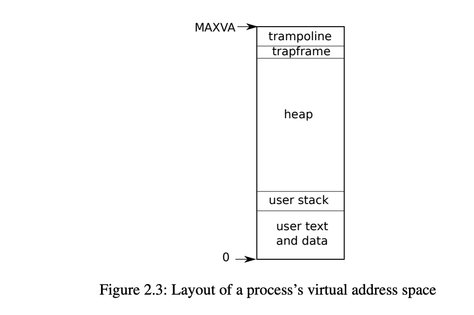
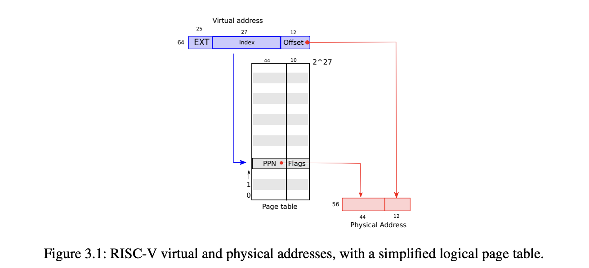

# 二周目

### speed up sys call
关于在usyscall中定义什么能够更快的使得xv6进行系统调用，  
我认为可以加上进程的父进程。这样在fork时可以更快的找到该进程的父进程，而不用去进程池中逐个遍历从而获得该进程的父进程。

## 地址空间

### xv6地址空间
在[memlayout.h](../kernel/memlayout.h)中揭露了xv6的地址空间
```c
// Physical memory layout

// qemu -machine virt is set up like this,
// based on qemu's hw/riscv/virt.c:
//
// 00001000 -- boot ROM, provided by qemu
// 02000000 -- CLINT
// 0C000000 -- PLIC
// 10000000 -- uart0 
// 10001000 -- virtio disk 
// 80000000 -- boot ROM jumps here in machine mode
//             -kernel loads the kernel here
// unused RAM after 80000000.

// the kernel uses physical memory thus:
// 80000000 -- entry.S, then kernel text and data
// end -- start of kernel page allocation area
// PHYSTOP -- end RAM used by the kernel

```
这段注释描述了 RISC-V 架构中的物理内存布局。各个设备和内存区域在物理内存中的地址范围如下：

* 00001000：引导 ROM（Boot ROM），由 qemu 提供的引导代码。
* 02000000：CLINT（Core Local Interruptor），用于处理核间中断。
* 0C000000：PLIC（Platform-Level Interrupt Controller），用于处理外部设备的中断。
* 10000000：uart0，串口设备。
* 10001000：virtio disk，虚拟磁盘设备。
* 80000000：引导 ROM 在机器模式下跳转到的地址，同时也是内核加载的起始地址。
* end：内核代码和数据的结束地址。
* PHYSTOP：内核使用的最后一个物理内存地址。  

这段注释主要用于说明在 qemu 模拟器中，各个设备和内存区域在物理内存中的地址范围，以及内核加载的地址范围。这对于了解和调试在 RISC-V 架构上运行的操作系统或内核非常有用。
### 进程地址空间

进程地址空间如下所示，在[riscv.h](../kernel/riscv.h) 定义了$MAXVA = (1L << (9 + 9 + 9 + 12 - 1))$ （不妨理解为 三级页表，每级页表有9位，页内偏移12位，因此最大地址为MAXVA。）   
从高地址到地址分别是trampoline，trapframe，堆，栈，数据区，代码区。  
* Trampoline 段是一个特殊的代码段，（可读不可写，且可执行）用于实现用户态和内核态之间的切换。它包含了一些必要的指令和数据，用于保存和恢复上下文、进行模式切换等操作。
* Trapframe 段保存在系统调用时，需要保存和恢复的寄存器，其具体操作保存在trampoline.S中。  
* 堆段是动态分配地址，且随机获得地址。
* 栈段是固定大小，且由高地址向低地址增长的，在内存中，栈的顶部位于较高的地址，而栈的底部位于较低的地址。
* 数据段和代码段不做过多介绍。




## 页表 pagetable
对于给定的虚拟地址，我们要找到其物理地址，需要进行类似查表的操作，但是我们不会将所有页表的对应关系常驻内存，因此设计了三级页表结构，这样能大大减少页表驻留内存的数量。xv6使用的虚拟内存管理方案为`sv39`。    

     


SV39 的页表结构包括三级：
1. 顶级目录（Level-2 Page Table）：用于将虚拟地址的高 9 位映射到二级页表。
2. 二级页表（Level-1 Page Table）：用于将虚拟地址的中间 9 位映射到叶级页表。
3. 叶级页表（Leaf Page Table）：用于将虚拟地址的低 9 位映射到物理地址。   

将低12位作为页内偏移，这是对应每一页的大小为4MB（4096=1\<\<12\) 。

具体的实现如下图所示。   

    

首先从stap寄存器获得顶级目录的地址，根据L2获得二级目录的地址，再根据L1获得一级目录的地址，，再根据L0获得最终的物理地址，和页内偏移拼接就得到了真实的物理地址PPN。  
对于每一个物理页，后10位表示标记位，具体见上图。第[53, 10]位表示其存储的物理地址。   

具体到每一页的目录表中，L1表示表的index-索引，因此每个页表可以看作一个一维数组，根据索引就可以得到下一级目录的物理地址。（页大小4096 / 索引大小512）= 8字节， 而64位中仅使用低54位，保留高字节不使用。   


具体的地址转换逻辑可查看[vm.c](../kernel/vm.c)中的`walk函数`是如何实现的。


