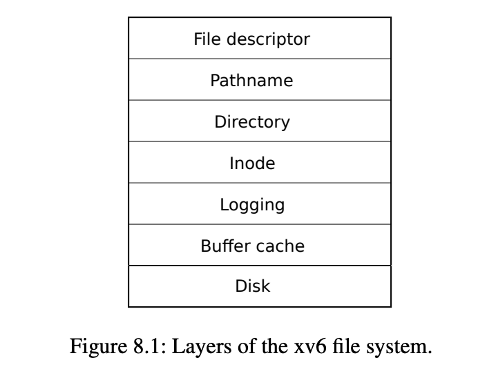
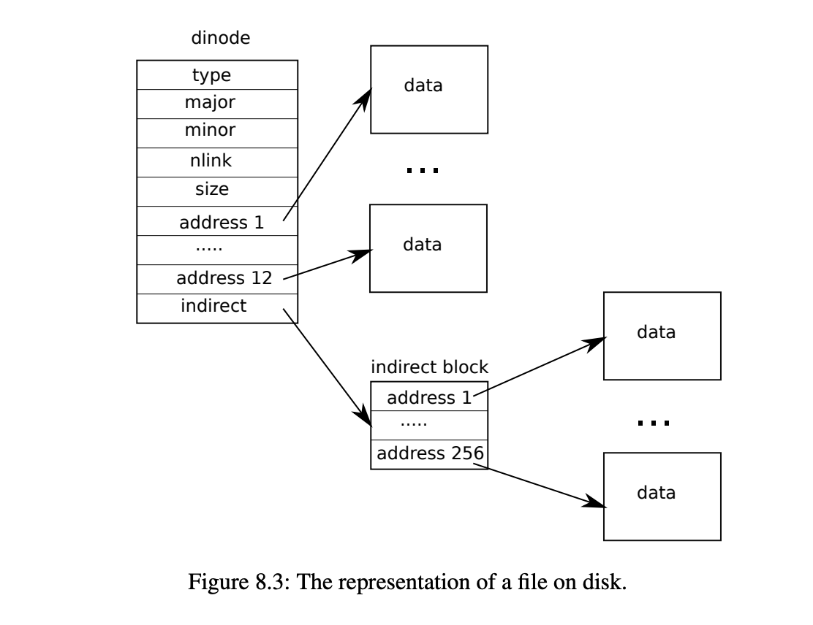

# 五周目

## [日志](../kernel/log.c)

xv6对于文件操作会经历写日志的过程，首先向日志中写入操作，然后再写入到文件系统中。

log分为以下阶段
1. 写入log
2. 提交log
3. 写入文件系统
4. 删除日志

这样可以保证机器发生crash时，保证文件系统的安全，并能够从crash中恢复。

log的数据结构定义如下，其中block保存磁盘块的索引，这样就能调用bread和bwrite函数实现向磁盘中的读写操作。
```c
struct logheader {
  int n;
  int block[LOGSIZE];
};

struct log {
  struct spinlock lock;
  int start;
  int size;
  int outstanding; // how many FS sys calls are executing.
  int committing;  // in commit(), please wait.
  int dev;
  struct logheader lh;
};
struct log log;
```
### beginop

```c
// called at the start of each FS system call.
void
begin_op(void)
{
  acquire(&log.lock);
  while(1){
    if(log.committing){
      sleep(&log, &log.lock);
    } else if(log.lh.n + (log.outstanding+1)*MAXOPBLOCKS > LOGSIZE){
      // this op might exhaust log space; wait for commit.
      sleep(&log, &log.lock);
    } else {
      log.outstanding += 1;
      release(&log.lock);
      break;
    }
  }
}
```
beginop函数主要检查是否正在提交日志，或者日志剩余容量不足，否则就将日志的引用计数加一。

### endop

endop除了要将引用计数jianyi外，还需要判断是否能够提交日志，如果能够提交日志，则调用commit提交日志。

```c
// called at the end of each FS system call.
// commits if this was the last outstanding operation.
void
end_op(void)
{
  int do_commit = 0;

  acquire(&log.lock);
  log.outstanding -= 1;
  if(log.committing)
    panic("log.committing");
  if(log.outstanding == 0){
    do_commit = 1;
    log.committing = 1;
  } else {
    // begin_op() may be waiting for log space,
    // and decrementing log.outstanding has decreased
    // the amount of reserved space.
    wakeup(&log);
  }
  release(&log.lock);

  if(do_commit){
    // call commit w/o holding locks, since not allowed
    // to sleep with locks.
    commit();
    acquire(&log.lock);
    log.committing = 0;
    wakeup(&log);
    release(&log.lock);
  }
}
```

### commit

commit操作要执行以下操作
1. 调用write_log()函数，将缓存中修改过的块写入日志。
2. 调用write_head()函数，将日志的头块写入磁盘，实际进行提交操作。
3. 调用install_trans(0)函数，将日志中的写操作安装到相应的位置（即写回到文件系统的主位置）。
4. 将日志的记录数重置为0，表示日志已经提交。
5. 再次调用write_head()函数，擦除日志中的事务信息，即将头块中的块号清零。

实现擦除操作是因为在第二次调用前将log.lh.n 置为 0，然后调用write_head（），将对应buf中的n置为0，表示没有日志的状态。

至于从log中恢复的操作，只需从buf中读取log，然后应用到磁盘中即可。

## 深入文件系统

> 计算机领域的任何问题都可以通过增加一个间接的中间层来解决

文件系统中的抽象层由低到高为硬盘到文件描述符等，如下所示。




xv6中目前实现的是一级文件系统如下所示，由12个直接索引和1个间接索引实现。

最大的大小为$（256+12）* 1024$ ，在bigfile实验中，要求实现一个二级间接索引，此时文件大小为$(256*256+256+11)*1024$。 



TODO

## mmap

有关mmap的介绍可以查看这两个网站

1. [https://www.man7.org/linux/man-pages/man2/mmap.2.html](https://www.man7.org/linux/man-pages/man2/mmap.2.html)
2. [https://en.wikipedia.org/wiki/Mmap](https://en.wikipedia.org/wiki/Mmap)

通过将文件直接映射进内存以实现对文件的高效读写，


### 虚拟内存区域

首先定义虚拟内存区域vma。

```c
struct VMA{
  uint64 addr;        // 虚拟内存起始地址
  int length;         // 要映射的字节数
  int prot;           // 页表标志位
  int flags;          // 是否要写回文件
  int fd;             // 文件描述符
  int offset;         // 偏移量
  struct file *file;  // 被映射的文件
  int free_len;       // 已经被取消映射的长度
};

```

### mmap

实现mmap系统调用比较简单，只需在proc->vma中寻找一个未映射的位置，将对应信息保存下来，包括起始字节，长度，标志，偏移等。

此时向文件中写入的话会出现读写错误。在trap中处理错误。如果发生读写异常，就获得出错的地址，然后分配一个新页，将文件内容读取到新页中，以后将新页映射到出错的位置。

```c
 } else if((which_dev = devintr()) != 0){
    // ok
  } else if (r_scause() == 13 || r_scause()==15) {  //读异常
    uint64 va = r_stval();        //获得出错的虚拟地址 
    int idx = -1;
    for(int i = 0; i < 16; i++)                         //通过出错地址寻找对应的vma
      if(va >= p->vma[i].addr && va < p->vma[i].addr + p->vma[i].length){
        idx = i;
        break;
      }
    if (idx == -1) goto err;  


    char *mem;
    if((mem = kalloc()) == 0)  
      setkilled(p);
    else{
      memset(mem, 0, PGSIZE);
      va = PGROUNDDOWN(va);
      struct inode *ip = p->vma[idx].file->ip;
      ilock(ip);
      readi(ip, 0, (uint64)mem, p->vma[idx].offset + (va - p->vma[idx].addr), PGSIZE);
      iunlock(ip);
    
      int pte_flag = PTE_U;
      if(p->vma[idx].prot & PROT_READ) pte_flag |= PTE_R;
      if(p->vma[idx].prot & PROT_WRITE) pte_flag |= PTE_W;
      if(p->vma[idx].prot & PROT_EXEC) pte_flag |= PTE_X;
    
      if(mappages(p->pagetable, va, PGSIZE, (uint64)mem, pte_flag) != 0){
        kfree(mem);
        setkilled(p);
      }
    }
  } else {
    err:
      printf("usertrap(): unexpected scause %p pid=%d\n", r_scause(), p->pid);
      printf("            sepc=%p stval=%p\n", r_sepc(), r_stval());
      setkilled(p);
    }

```

### munmap

实现munmap需要判断传参是否合法，然后判断是否需要写回文件，如果需要写回文件，将执行`writei`将addr处长为length的内容写入文件，最后取消映射。

最后判断减少对文件的引用，判断是否需要关闭该文件。


