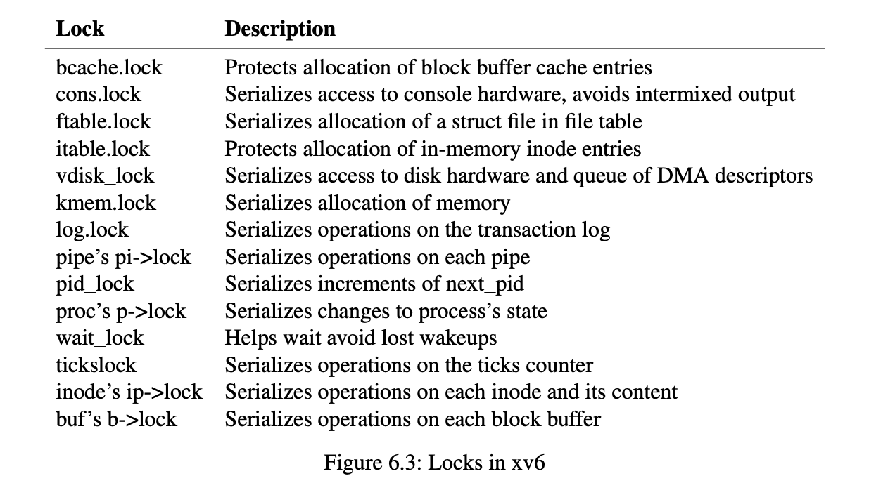

# 四周目

在xv6中的数个地方都使用了锁，xv6实现了两种不同的锁

1. [spinlock](../kernel/spinlock.h)自旋锁
2. [sleeplock](../kernel/sleeplock.h)睡眠锁




## spinlock

上锁的逻辑类似于
```c
void
acquire(struct spinlock *lk) // does not work!
{
    for(;;) {
        if(lk->locked == 0) {
            lk->locked = 1;
            break;
        }
    }
}

```

自旋锁的逻辑是循环等待，如果当前锁被持有，则阻塞进程，直到锁被释放，然后自己能持有锁。

但是由于中断机制，指令在执行时可能被打断，比如调度等。因此在获得锁之前要关中断，释放锁后要开中断。 

同时还需要`__sync_synchronize()`函数避免指令重排。

## sleeplock

sleeplock的实现是基于自旋锁来实现的，如果该锁被持有，那么该进程就睡眠。直到该锁被释放为止，该进程被唤醒持有锁，从而继续执行。


### 对比

对比两种锁，自旋锁采用循环等待逻辑，sleeplock采用阻塞即sleep的逻辑。

可知前者主要应用在等待时间较短的情况下，如请求页表，进程等待。后者应用在等待时间较长的情况下，比如文件操作，日志操作等。


