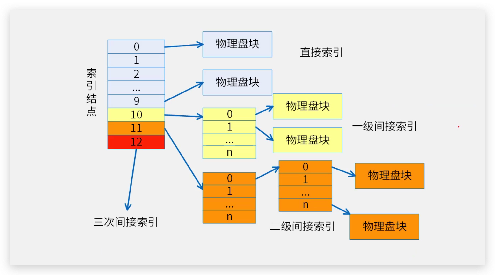

# fs

## Large files

本实验要我们实现一个二级索引。图示如下。

* 一级文件索引如下 
* 多级文件索引如下 

在只有直接索引和一级索引的条件下，最大文件大小只有`#define MAXFILE (NDIRECT + NINDIRECT)  12+256` 个块大小。

在添加二级索引后，最大文件大小为`#define MAXFILE (NDIRECT + NINDIRECT + NINDIRECT * NINDIRECT) //11+256+256*256`个块。

因此我们先修改宏定义。

```c

#define NDIRECT 11                                              // 12 -> 11
#define NINDIRECT (BSIZE / sizeof(uint))                        // 256
#define MAXFILE (NDIRECT + NINDIRECT + NINDIRECT * NINDIRECT)   //11+256+256*256  直接索引+一级索引+二级索引

// On-disk inode structure
struct dinode {
  short type;           // File type
  short major;          // Major device number (T_DEVICE only)
  short minor;          // Minor device number (T_DEVICE only)
  short nlink;          // Number of links to inode in file system
  uint size;            // Size of file (bytes)
  uint addrs[NDIRECT + 1 + 1];  // Data block addresses
};
```

然后查看[fs.c](../kernel/fs.c)中的bmap函数。仿照直接索引以及一级索引的方式即可处理二级索引。

```c
static uint
bmap(struct inode *ip, uint bn)
{
  uint addr, *a;
  struct buf *bp;

  if(bn < NDIRECT){   //直接索引
    if((addr = ip->addrs[bn]) == 0){
      addr = balloc(ip->dev);
      if(addr == 0)
        return 0;
      ip->addrs[bn] = addr;
    }
    return addr;
  }
  bn -= NDIRECT;

  if(bn < NINDIRECT){  //一级索引
    // Load indirect block, allocating if necessary.
    if((addr = ip->addrs[NDIRECT]) == 0){
      addr = balloc(ip->dev);
      if(addr == 0)
        return 0;
      ip->addrs[NDIRECT] = addr;
    }
    bp = bread(ip->dev, addr);
    a = (uint*)bp->data;
    if((addr = a[bn]) == 0){
      addr = balloc(ip->dev);
      if(addr){
        a[bn] = addr;
        log_write(bp);
      }
    }
    brelse(bp);
    return addr;
  }
  bn -= NINDIRECT;

  if (bn < NINDIRECT * NINDIRECT) {  // 二级索引
    // Load doubly-indirect block, allocating if necessary.
    if ((addr = ip->addrs[NDIRECT + 1]) == 0)
      ip->addrs[NDIRECT + 1] = addr = balloc(ip->dev);
    bp = bread(ip->dev, addr);
    a = (uint *)bp->data;
    if ((addr = a[bn / NINDIRECT]) == 0) {
      a[bn / NINDIRECT] = addr = balloc(ip->dev);
      log_write(bp);
    }
    brelse(bp);
    bn %= NINDIRECT;
    bp = bread(ip->dev, addr);
    a = (uint *)bp->data;
    if ((addr = a[bn]) == 0) {
      a[bn] = addr = balloc(ip->dev);
      log_write(bp);
    }
    brelse(bp);
    return addr;
  }
  panic("bmap: out of range");
}
```


## Symbolic links

个人感觉符号连接实现起来比硬连接更加简单，硬连接需要使得两个文件指向同一个inode，而符号连接只需将target文件路径保存在path文件中，寻找到path
文件时，如果发现文件类型是符号连接则递归的寻找下去。直到找到最终的目标文件。

[软连接和硬连接的区别](https://zj-linux-guide.readthedocs.io/zh-cn/latest/tool-use/[ln]%E8%BD%AF%E9%93%BE%E6%8E%A5%E5%92%8C%E7%A1%AC%E9%93%BE%E6%8E%A5/)

首先按照要求，添加软连接文件类型。

```c
//stat.h
#define T_DIR     1   // Directory
#define T_FILE    2   // File
#define T_DEVICE  3   // Device
#define T_SYMLINK 4   // 软符号连接
```

然后实现系统调用，添加系统调用号，完善系统调用。

在synlink中，只需获取参数，然后将target写入path文件中，同时将文件类型设置为T_SYMLINK

```c

uint64 
sys_symlink(void)
{
  struct inode *ip;
  char target[MAXPATH], path[MAXPATH];
  argstr(0, target, MAXPATH);
  argstr(1, path, MAXPATH);

  begin_op();

  ip = create(path, T_SYMLINK, 0, 0);
  if (ip == 0) {
    end_op();
    return -1;
  }

  if(writei(ip, 0, (uint64)target, 0, strlen(target)) < 0) {
    end_op();
    return -1;
  }

  iunlockput(ip);
  end_op();
  return 0;
}
```


然后在open一个文件时，如果遇到符号连接，则递归的检查下去，直到找到最终的文件或者超过最大递归数。

如果打开文件携带标志`O_NOFOLLOW`，表示仅打开当前文件，不是递归的搜索。

```c

uint64
sys_open(void)
{
  char path[MAXPATH];
  int fd, omode;
  struct file *f;
  struct inode *ip;
  int n;

  argint(1, &omode);
  if((n = argstr(0, path, MAXPATH)) < 0)
    return -1;

  begin_op();

  if(omode & O_CREATE){
    ip = create(path, T_FILE, 0, 0);
    if(ip == 0){
      end_op();
      return -1;
    }
  } else {
    int symlink_depth = 0;
    while (1) {
      if((ip = namei(path)) == 0){
          end_op();
          return -1;
      }
      ilock(ip);
      if (ip->type == T_SYMLINK && (omode & O_NOFOLLOW) == 0) {
        if (++symlink_depth > 10) {
            iunlockput(ip);
            end_op();
            return -1;
        }
        if (readi(ip, 0, (uint64)path, 0, MAXPATH) < 0) {
            iunlockput(ip);
            end_op();
            return -1;
        }
        iunlockput(ip);
      } else {
          break;
      }
    }
```


