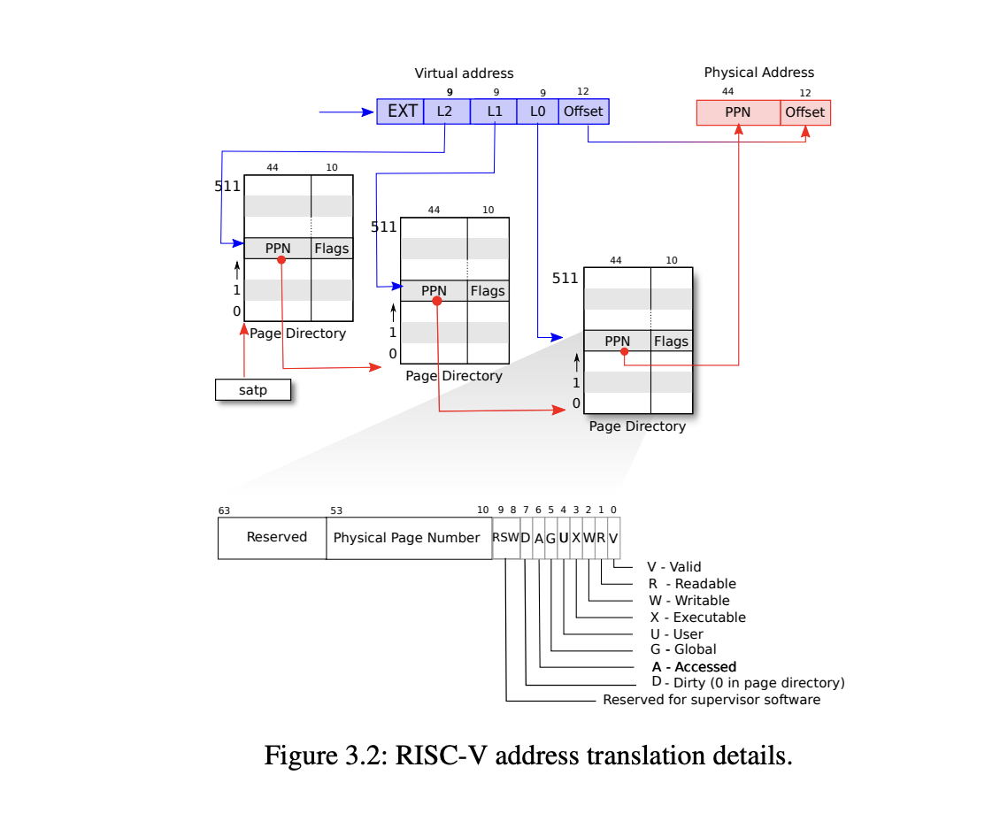

# page tables

## Speed up system calls

此实验要求我们实现一个映射`USYSCALL`的功能，其实现可参照`trapframe`的处理方式。

首先在proc.h中添加usyscall的声明

```c
//proc.h
  struct trapframe *trapframe; // data page for trampoline.S
  struct usyscall *usyscall;   // Speed up system calls 
```

然后在分配进程，free进程时仿照trepframe的处理方式分配页表以及free页表

```c
//proc.c
static struct proc*
allocproc(void)
{
    ///...
 // Allocate a trapframe page.
  if((p->trapframe = (struct trapframe *)kalloc()) == 0){
    freeproc(p);
    release(&p->lock);
    return 0;
  }

  // speed up user system call  init usyscall  
  if((p->usyscall = (struct usyscall *)kalloc()) == 0){
    freeproc(p);
    release(&p->lock);
    return 0;
  }
  p->usyscall->pid = p->pid;
}

static void
freeproc(struct proc *p)
{
  if(p->trapframe)
    kfree((void*)p->trapframe);
  p->trapframe = 0;
  if(p->usyscall)
    kfree((void *)p->usyscall);
  p->usyscall = 0;
}
```

最后仿照trapframe实现页表的映射。

```c
//proc.c
pagetable_t
proc_pagetable(struct proc *p)
{// map the trapframe page just below the trampoline page, for
  // trampoline.S.
  if(mappages(pagetable, TRAPFRAME, PGSIZE,
              (uint64)(p->trapframe), PTE_R | PTE_W) < 0){
    uvmunmap(pagetable, TRAMPOLINE, 1, 0);
    uvmfree(pagetable, 0);
    return 0;
  }
  if(mappages(pagetable, USYSCALL, PGSIZE,
              (uint64)p->usyscall, PTE_R | PTE_U) < 0){
    uvmunmap(pagetable, TRAMPOLINE, 1, 0);
    uvmunmap(pagetable, TRAPFRAME, 1, 0);
    uvmfree(pagetable, 0);
    return 0;
}
}
```

此时运行`make qemu` 会无法启动qemu，检查后发现在`proc_freepagetable`没有取消usyscall的映射。

```c
//proc.c
// Free a process's page table, and free the
// physical memory it refers to.
void
proc_freepagetable(pagetable_t pagetable, uint64 sz)
{
  uvmunmap(pagetable, TRAMPOLINE, 1, 0);
  uvmunmap(pagetable, TRAPFRAME, 1, 0);
  uvmunmap(pagetable, USYSCALL, 1, 0);
  uvmfree(pagetable, sz);
}
```

## Print a page table

打印页表实现起来比较简单，查看[vm.c](../kernel/vm.c)中的walk的实现即可。xv6中使用的时sv39的地址转换方式，查看下图。


首先在exec.c中添加vmprint的函数调用

```c
int
exec(char *path, char **argv)
{
 if (p->pid == 1) vmprint(p->pagetable);
   return argc;  // this ends up in a0, the first argument to main(argc, argv)
}
```

然后在vm.c中实现vmprint函数

```c
// vm.c
 void _vmprint(pagetable_t p, int depth) {
     if (depth > 3) return;
     for (int i = 0; i < 512; i++) {
         pte_t pte = p[i];
         if (pte & PTE_V) {
             for (int j = 0; j < depth; j++) printf(" ..");
             uint64 child = PTE2PA(pte);
             printf("%d: pte %p pa %p\n", i, pte, child);
             _vmprint((pagetable_t)child, depth + 1);
         }
     }
 }
 void vmprint(pagetable_t p) {
     printf("page table %p\n", p);
     _vmprint(p, 1);
 }  
```

## Detect which pages have been accessed

此实验要检查那些页表是被cpu访问过的，riscv的标记位中第6位表示那些页表是被cpu访问过的被访问的页表此标记位会被置为1，因此我们首先需要在riscv.h中添加此标记位。

```c
//riscv.h
#define PTE_U (1L << 4) // user can access
#define PTE_A (1L << 6) // Detect which pages have been accessed
```

然后实现sys_pgaccess函数即可

```c
//sysproc.c
sys_pgaccess(void)
 {
   // lab pgtbl: your code here.
   uint64 addr;
   int n;
   int bitmask;
   argaddr(0, &addr);
   argint(1, &n);
   argint(2, &bitmask);

   struct proc* p = myproc();
   int res = 0;

   for (int i = 0; i < n; ++i) {
     pte_t* pte = walk(p->pagetable, addr + i * PGSIZE, 0);
     if (pte == 0) continue;
     if (*pte & PTE_A) {
       res |= (1 << i);
       *pte &= ~PTE_A;
       }
     }

   if (copyout(p->pagetable, bitmask, (char*)&res, sizeof(res)) < 0)
     return -1;
   return 0;
 }
```


