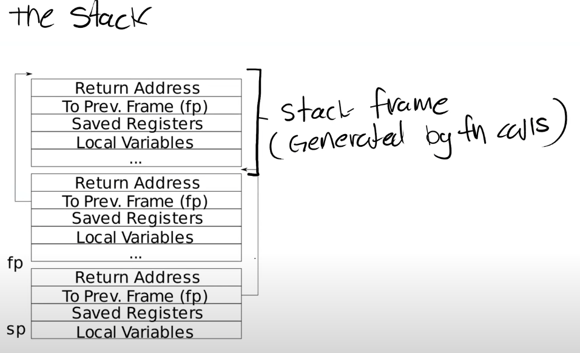

# traps

## Backtrace 

首先将获得fp的代码添加到riscv.h中

```c
static inline uint64
r_fp()
{
  uint64 x;
  asm volatile("mv %0, s0" : "=r" (x) );
  return x;
}
```

然后观察栈的结构


fp的上一个地址就是ra，由于栈的大小都是16，这个可以通过反汇编的汇编代码得知，因此将fp转换为指针地址，此时frame[-1]就是ra，frame[-2]就是调用者栈帧的fp地址。

```c
//printf.c
void backtrace(void) {
  uint64 fp = r_fp();
  uint64 *frame = (uint64 *)fp;
  uint64 up = PGROUNDUP(fp);
  uint64 down = PGROUNDDOWN(fp);
  while (fp < up && fp > down) {
    printf("%p\n", frame[-1]);
    fp = frame[-2];
    frame = (uint64 *)fp;
  }
}

```

## Alarm

首先本实验要求实现`sigalarm`和`sigreturn`系统调用，因此需要添加函数原型，并注册系统调用号，然后就需要实现系统调用。

### sigalarm

此系统调用需要将ticks和handler保存斤proc结构体中，需要在proc中添加一下字段。

```c
// alarm
  int currentticks;   //保存当前经过了多少时钟周期
  int tickcount;      //保存ticks
  uint64 handler;     //保存handler
  struct trapframe tick_trapframe;   // 保存寄存器
  int tick_handled;   //  标记是否被处理，因为后面要求只处理一次
```

在初始化进程时要对相关字段进行初始化。在freeproc时也可以对相关字段进行处理。

```c
static struct proc*
allocproc(void)
{
found:
  p->pid = allocpid();
  p->state = USED;
  p->tickcount = 0;
  p->currentticks = 0;
  p->handler = 0;
  p->tick_handled = 0;
}
```

sigalarm就是获得参数并保存进proc中。

```c

uint64 
sys_sigalarm(void)
{
  int ticks;
  uint64 handler;
  argint(0, &ticks);
  argaddr(1, &handler);
  struct proc *p = myproc();

  p->tickcount = ticks;
  p->handler = handler;
  return 0;
}
```

然后在trap.c中对时钟中断进行处理。即` if(which_dev == 2) ...`。这里判断如果`currentticks > tickcount ` 并且未处理过该中断，就将寄存器保存进tick_trapframe中，
使得epc指向handler，此时就从handler处继续执行。

```c
void
usertrap(void)
{
if(which_dev == 2){
    if (p->tickcount > 0) {
      p->currentticks++;
      if (p->currentticks > p->tickcount && !p->tick_handled) {
          p->currentticks = 0;
          p->tick_handled = 1;
          p->tick_trapframe = *(p->trapframe);
          p->trapframe->epc = p->handler;
      }
    }

    yield();
  }
}
```


which_dev是调用`which_dev = devintr()`得到，devintr函数如下所示。可知返回值如下

+ 2 表示时钟中断
+ 1 表示其他设备中断
+ 0 表示未知中断

```c

// check if it's an external interrupt or software interrupt,
// and handle it.
// returns 2 if timer interrupt,
// 1 if other device,
// 0 if not recognized.
int
devintr()
{
  uint64 scause = r_scause();

  if((scause & 0x8000000000000000L) &&
     (scause & 0xff) == 9){
    // this is a supervisor external interrupt, via PLIC.

    // irq indicates which device interrupted.
    int irq = plic_claim();

    if(irq == UART0_IRQ){
      uartintr();
    } else if(irq == VIRTIO0_IRQ){
      virtio_disk_intr();
    } else if(irq){
      printf("unexpected interrupt irq=%d\n", irq);
    }

    // the PLIC allows each device to raise at most one
    // interrupt at a time; tell the PLIC the device is
    // now allowed to interrupt again.
    if(irq)
      plic_complete(irq);

    return 1;
  } else if(scause == 0x8000000000000001L){
    // software interrupt from a machine-mode timer interrupt,
    // forwarded by timervec in kernelvec.S.

    if(cpuid() == 0){
      clockintr();
    }
    
    // acknowledge the software interrupt by clearing
    // the SSIP bit in sip.
    w_sip(r_sip() & ~2);

    return 2;
  } else {
    return 0;
  }
}
```

### sigreturn

return时比较简单，只需要恢复寄存器，就返回到原来的状态进行继续执行。

> 寄存器表示程序目前的执行状态

```c

uint64 
sys_sigreturn(void)
{
  struct proc* p = myproc();
  p->tick_handled = 0;
  *(p->trapframe) = p->tick_trapframe;
  return p->trapframe->a0;
}
```

最后要求返回a0寄存器，这里不是很明白。


